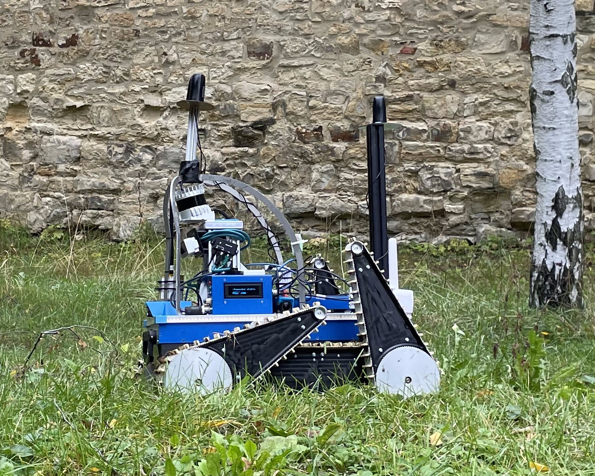
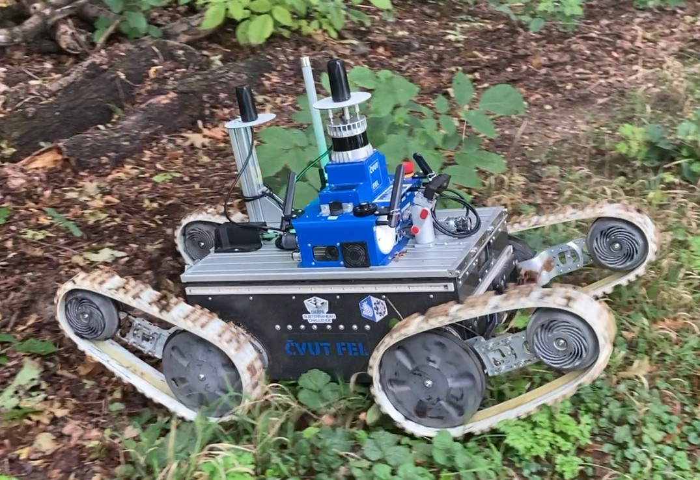

# Rugged Obstacles and Uneven Ground Hardcore (ROUGH) Dataset

> [!IMPORTANT]
> Let the robots freely roam in the countryside!

## Overview

ROUGH Dataset contains **several hours** of driving with <abbr title="~1 m, ~60 kg, cameras <0.5 m from ground">mid-sized robots</abbr> in challenging terrain.
The ultimate goal is to provide recordings of traversals on (or through) **flexible natural obstacles** like **tall grass**, **hanging tree branches**, **mud**, **dense undergrowth** etc.

Datasets like [RUGD](http://rugd.vision/), [BotanicGarden](https://github.com/robot-pesg/BotanicGarden) or [RELLIS-3D](https://www.unmannedlab.org/the-great-outdoors-dataset/) provide data mostly with the aim of training image/pointcloud segmentation networks or tuning SLAM algorithms.

ROUGH aims directly at learning how to drive through the challenging terrain.
Having correct segmentation is not sufficient for successful traversal - also the robot dynamics, terrain properties and control algorithm need to be taken into account. For example, 5 cm deep mud might be a stopping condition for a robot with 10 cm wheels or tracks, while it will be almost unnoticeable for a 5 m tank. Simply, knowing the semantic class `mud` is just a part of the story.

The majority of ROUGH sequences were collected with shape-changing tracked robots, which allows capturing a much larger range of dynamics responses - simply moving the auxiliary tracks changes the center and moments of inertia and the contact surface. To correctly utilize the effects of dynamics, ROUGH provides not only the sensory data, but also robot models with dynamics properties.

A great application for ROUGH is self-supervised training of PINNs (_Physics-Informed Neural Networks_) on trajectory data, as in [MonoForce](https://github.com/ctu-vras/monoforce). Can you guess a robot's future trajectory given just a single onboard image, robot model and control algorithm? MonoForce can do that!

> [!CAUTION]
> The dataset is still in preparation and will be submitted to an IEEE journal. Hopefully in Nov '24. Click 'Watch' on top of this page to get project updates.

## Platforms

The robots used in ROUGH have almost identical sensory equipment. This is just a list of the platforms, and the sensors description follows in the next section. 

### Bluebotics Absolem

[Absolem](https://web.archive.org/web/20180130012555/https://bluebotics.com/mobile-robotics/absolem/) is a custom-built tracked robot with 2 main tracks and 4 independently controlled auxiliary tracks.
The first revision of the robot came to the world in 2011 in [NIFTi project](https://nifti.eu), then it got HW upgrade for [TRADR project](https://www.tradr-project.eu/) in 2015, and in 2019 it got another upgrade for the [DARPA SubT Challenge](https://robotics.fel.cvut.cz/cras/darpa-subt/).

**Stats**

| Weight | Width | Length | Height | Main Motors                                                               | Aux Motors                                                                |
|--------|-------|--------|--------|---------------------------------------------------------------------------|---------------------------------------------------------------------------|
| 40 kg  | 60 cm | 67 cm  | 100 cm | 2x 210 W (<abbr title="Rated torque at transmission output">30 Nm</abbr>) | 4x 210 W (<abbr title="Rated torque at transmission output">30 Nm</abbr>) |

### MARV

[MARV](https://marvrobot.com/) is a commercially available (yet prototype) agile tracked robot with 4 independently controlled tracks.
It was designed in 2020 for the needs of [VRAS research group](https://github.com/ctu-vras/) and qualified for [DARPA SubT Challenge](https://robotics.fel.cvut.cz/cras/darpa-subt/).

**Stats**

| Weight | Width | Length | Height | Main Motors                                                            | Aux Motors                                                              |
|--------|-------|--------|--------|------------------------------------------------------------------------|-------------------------------------------------------------------------|
| 70 kg  | 60 cm | 60 cm  | 100 cm | 200 W (<abbr title="Rated torque at transmission output">25 Nm</abbr>) | 200 W (<abbr title="Rated torque at transmission output">180 Nm</abbr>) |

## Sensors

| Sensor                                                                                                                                                                                                                                                | Type                  | Rate   | Resolution                   | Sync           | Timestamp accuracy | Topics                                                                                                                                 |
|-------------------------------------------------------------------------------------------------------------------------------------------------------------------------------------------------------------------------------------------------------|-----------------------|--------|------------------------------|----------------|--------------------|----------------------------------------------------------------------------------------------------------------------------------------|
| [Ouster OS0-128](https://data.ouster.io/downloads/datasheets/datasheet-revd-v2p5-os0.pdf)                                                                                                                                                             | 3D lidar              | 10 Hz  | 1024x10                      | Trigger source | 20 µs              | `/points_filtered_*`                                                                                                                   |
| [Ouster IMU](https://www.invensense.com/products/motion-tracking/9-axis/icm-20948)                                                                                                                                                                    | IMU                   | 100 Hz | 0.008 °/s, 61 µg             | HW from lidar  | 20 µs              | `/os_cloud_node/imu`                                                                                                                   |
| [Basler a2A1920-51gcPRO](https://www.baslerweb.com/en/shop/a2a1920-51gcpro/) + [4 mm lens](https://www.baslerweb.com/en/shop/lens-c125-0418-5m-p-f4mm/)                                                                                               | RGB camera            | 10 Hz  | 1920x1200                    | HW from lidar  | 200 µs             | `/camera_(front\|left\|rear\|right\|up)/image_color/compressed`                                                                        |
| [Basler acA2040-35gc](https://www.baslerweb.com/en/shop/aca2040-35gc/) + [1.8 mm fisheye lens](https://www.baslerweb.com/en/shop/evetar-lens-m118b029528ir-f2-8-f2-95mm-1-1-8/)                                                                       | RGB camera            | 30 Hz  | 2048x1536                    | No sync        | Unknown            | `/camera_fisheye_(front\|rear)/compressed`                                                                                             |
| [Luxonis OAK-D Pro](https://shop.luxonis.com/products/oak-d-pro)                                                                                                                                                                                      | RGB-D camera          | 30 Hz  | 1920x1080 RGB, 800x480 depth | No sync        | 200 µs             | `/oak/rgb/image_raw/compressed`, `/oak/stereo/image_raw/compressedDepth`                                                               |
| [Luxonis OAK-D Pro IMU](https://www.ceva-ip.com/wp-content/uploads/2019/10/BNO080_085-Datasheet.pdf)                                                                                                                                                  | IMU                   | 100 Hz | ???                          | No sync        | 200 µs             | `/oak/imu/data`, `/oak/imu/mag`                                                                                                        |
| [Movella MTI-30](https://mtidocs.movella.com/mti-hardware-platforms)                                                                                                                                                                                  | IMU                   | 100 Hz | ???                          | No sync        | Unknown            | `/imu/data`, `/imu/mag`, `/imu_unbiased/data` (removed gyro bias), `/imu/mag_unbiased` (removed internal hard-iron and soft-iron bias) |
| [Emlid Reach M+](https://web.archive.org/web/20230321054620/https://emlid.com/reach/) with [helical 3-band antenna](https://www.ardusimple.com/product/lightweight-helical-tripleband-l-band-antenna-ip67/)                                           | 1-band GNSS           | 5 Hz   | ???                          | No sync        | Unknown            | `/fix`, `/fix_status`, `/llh`                                                                                                          |
| [Septentrio Mosaic-go Heading Evaluation Kit](https://shop.septentrio.com/en/shop/mosaic-go-heading-gnss-module-evaluation-kit) + 2x [helical 3-band antenna](https://www.ardusimple.com/product/lightweight-helical-tripleband-l-band-antenna-ip67/) | 2-band 2-antenna GNSS | 10 Hz  | ???                          | No sync        | Unknown            | `/gnss/septentrio/*`                                                                                                                   |

## License

The data in ROUGH dataset are provided under the [Open Data Commons Open Database License (ODbL) v1.0](LICENSE). It is similar to CC-BY-SA, but more suitable for datasets. It explicitly states that <abbr title="Produced Work">works just using the data</abbr> (and not creating another dataset) do not need to be released under the same license. In any case, you are obliged to attribute the use of the dataset.

## Acknowledgements

The dataset was created by Martin Pecka, Bedřich Himmel, Valentýn Číhala, Ruslan Agishev, Karel Zimmermann and Tomáš Svoboda, all members of the [VRAS group](https://github.com/ctu-vras/) @ [Czech Technical University in Prague](https://cvut.cz).

This work was co-funded by the European Union under the project Robotics and Advanced Industrial Production (reg. no. CZ.02.01.01/00/22 008/0004590) and by the Czech Science Foundation under Project 24-12360S.